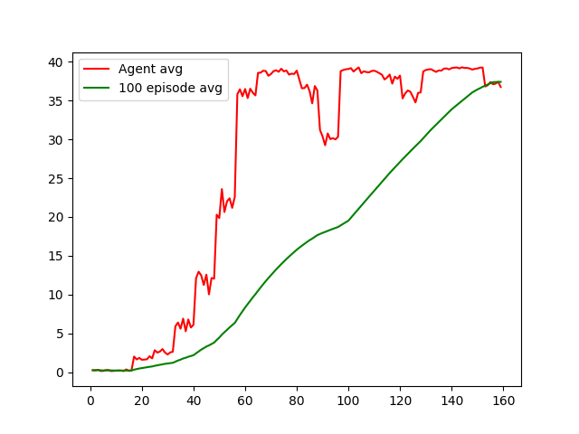

# Continuous Control in Reinforcement Learning

This repository is based on the continuous control problem studied in the Deep Reinforcement Learning Nanodegree program and demonstrates a variant of the PPO  algorithm in an environment with a continuous action space.

### General Settings (see also the original [repo](https://github.com/udacity/deep-reinforcement-learning/tree/master/p2_continuous-control))

In this project we use the [Reacher](https://github.com/Unity-Technologies/ml-agents/blob/master/docs/Learning-Environment-Examples.md#reacher) environment.


In this environment, a double-jointed arm can move to target locations. A reward of +0.1 is provided for each step that the agent's hand is in the goal location. Thus, the goal of your agent is to maintain its position at the target location for as many time steps as possible.

The observation space consists of 33 variables corresponding to position, rotation, velocity, and angular velocities of the arm. Each action is a vector with four numbers, corresponding to torque applicable to two joints. Every entry in the action vector should be a number between -1 and 1.

### Distributed Training

The environment is implemented as a predefined [*Unity* environment](https://github.com/Unity-Technologies/ml-agents), and two two separate versions of this environment are available:
- The first version contains a single agent.
- The second version contains 20 identical agents, each with its own copy of the environment.  

You can use the code in this repository with both versions. The presented results are obtained with the second version though.

### Solving the Environment

The environment is considered solved if the  agents achieve an average score of +30 (over 100 consecutive episodes, and over all agents).  Specifically,
- After each episode, we add up the rewards that each agent received (without discounting), to get a score for each agent.  This yields 20 (potentially different) scores.  We then take the average of these 20 scores.
- This yields an **average score** for each episode (where the average is over all 20 agents).

The environment is considered solved, when the average (over 100 episodes) of those average scores is at least +30.

### Getting started (see also the original [repo](https://github.com/udacity/deep-reinforcement-learning/tree/master/p2_continuous-control))

To set up your python environment to run the code in this repository, follow this steps:

1. Create (and activate) a new environment with Python 3.6.

	- __Linux__ or __Mac__:
	```bash
	conda create --name cocontrol python=3.6
	source activate cocontrol
	```
	- __Windows__:
	```bash
	conda create --name cocontrol python=3.6
	activate cocontrol
	```

3. Then install the dependencies from the requirements.txt file in this repository:
```bash
pip install requirements.txt
```

4. Download the *Unity* environment from one of the links below. You must select **only** the environment that matches your operating system:
  - **_Version 1: One (1) Agent_**
      - Linux: [click here](https://s3-us-west-1.amazonaws.com/udacity-drlnd/P2/Reacher/one_agent/Reacher_Linux.zip)
      - Mac OSX: [click here](https://s3-us-west-1.amazonaws.com/udacity-drlnd/P2/Reacher/one_agent/Reacher.app.zip)
      - Windows (32-bit): [click here](https://s3-us-west-1.amazonaws.com/udacity-drlnd/P2/Reacher/one_agent/Reacher_Windows_x86.zip)
      - Windows (64-bit): [click here](https://s3-us-west-1.amazonaws.com/udacity-drlnd/P2/Reacher/one_agent/Reacher_Windows_x86_64.zip)

  - **_Version 2: Twenty (20) Agents_**
      - Linux: [click here](https://s3-us-west-1.amazonaws.com/udacity-drlnd/P2/Reacher/Reacher_Linux.zip)
      - Mac OSX: [click here](https://s3-us-west-1.amazonaws.com/udacity-drlnd/P2/Reacher/Reacher.app.zip)
      - Windows (32-bit): [click here](https://s3-us-west-1.amazonaws.com/udacity-drlnd/P2/Reacher/Reacher_Windows_x86.zip)
      - Windows (64-bit): [click here](https://s3-us-west-1.amazonaws.com/udacity-drlnd/P2/Reacher/Reacher_Windows_x86_64.zip)

(_For Windows users_) Check out [this link](https://support.microsoft.com/en-us/help/827218/how-to-determine-whether-a-computer-is-running-a-32-bit-version-or-64) if you need help with determining if your computer is running a 32-bit version or 64-bit version of the Windows operating system.

(_For AWS_) If you'd like to train the agent on AWS (and have not [enabled a virtual screen](https://github.com/Unity-Technologies/ml-agents/blob/master/docs/Training-on-Amazon-Web-Service.md)), then please use [this link](https://s3-us-west-1.amazonaws.com/udacity-drlnd/P2/Reacher/one_agent/Reacher_Linux_NoVis.zip) (version 1) or [this link](https://s3-us-west-1.amazonaws.com/udacity-drlnd/P2/Reacher/Reacher_Linux_NoVis.zip) (version 2) to obtain the "headless" version of the environment.  You will **not** be able to watch the agent without enabling a virtual screen, but you will be able to train the agent.  (_To watch the agent, you should follow the instructions to [enable a virtual screen](https://github.com/Unity-Technologies/ml-agents/blob/master/docs/Training-on-Amazon-Web-Service.md), and then download the environment for the **Linux** operating system above._)

5. Place and unzip the downloaded file into one of the following locations corresponding to your operating system:
  - **Mac**: `"cocontrol/resources/Reacher.app"`
  - **Windows** (x86): `"cocontrol/resources/Reacher_Windows_x86/Reacher.exe"`
  - **Windows** (x86_64): `"cocontrol/resources/Reacher_Windows_x86_64/Reacher.exe"`
  - **Linux** (x86): `"cocontrol/resources/Reacher_Linux/Reacher.x86"`
  - **Linux** (x86_64): `"cocontrol/resources/Reacher_Linux/Reacher.x86_64"`
  - **Linux** (x86, headless): `"cocontrol/resources/Reacher_Linux_NoVis/Reacher.x86"`
  - **Linux** (x86_64, headless): `"cocontrol/resources/Reacher_Linux_NoVis/Reacher.x86_64"`

It is important that the *cocontrol/resources* folder **_only contains the agent for your operating system_**!

6. To be able to run the `Continuous_Control.ipynb` notebook, create an [IPython kernel](http://ipython.readthedocs.io/en/stable/install/kernel_install.html) for the `cocontrol` environment.  
```bash
python -m ipykernel install --user --name cocontrol --display-name "cocontrol"
```

7. Before running code in the notebook, change the kernel to match the `cocontrol` environment by using the drop-down `Kernel` menu.

### Instructions

The main script in the repository is `cocontrol.py`, which can be invoked to train the agent and store the result, as well as to replay the agent on a single episode from the stored learning results.

After all dependencies are set up as described in the [Getting started](#getting-started) section, the script can be invoked from the root directory of the repository as e.g.
```bash
> python cocontrol.py --dummy
```
to show the untrained agent on a single episode,
```bash
> python cocontrol.py --epochs 20
```
to execute learning on 20 epochs,
```bash
> python cocontrol.py --show
```
to replay the trained agent on a single episode and
```bash
> python cocontrol.py --replay
```
to run the trained agent on 100 episodes and print the obtained average score.

When invoked without command line parameters, the script will execute learning on 16 epochs. For help on the possible command line options execute the script with the --help option.

### Results

The parameters of the trained models can be found in the *actor_parameters.pt* and *critic_parameters.pt* files. The scores obtained during training are plotted in the *scores.png* file.

The included results achieve the target of an average score of +30 over 100 episodes in 128 episodes. They reach the target score of +30 in a single episode after 56 episodes and reach a top episode score close to 39 after 64 episodes.


